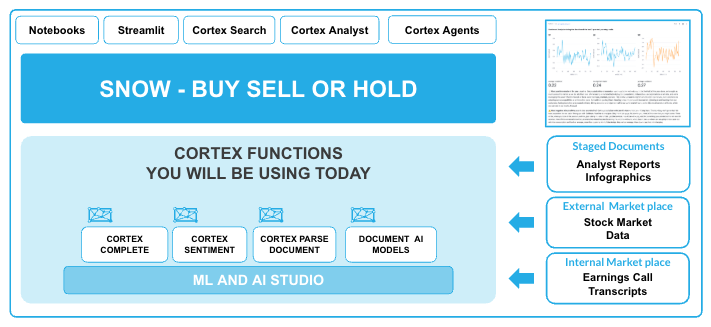
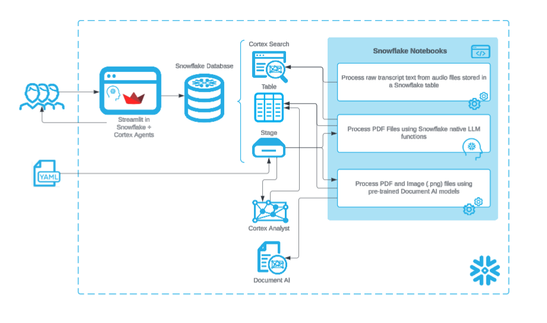

# <h0black>Build a Stock Selection Agent using </h0black><h0blue>Cortex and Document AI</h0blue>

<h1sub>Hands On Lab</h1sub>

## <h1sub>Introduction</h1sub>

Effective stock selection relies on having up-to-date data from diverse sources—research analyst reports, 10-K filings, investor call recordings, historical tick data, and real-time market feeds. To manage this efficiently, a unified platform is essential—one capable of storing and processing all data types, whether PDFs of analyst reports, MP3 investor recordings, or SEC documents.
This data must be readily accessible for analysis using the latest large language models (LLMs) such as Anthropic, Gemma, LLaMA, or DeepSeek. Ensuring the trustworthiness and security of generated summaries and insights is critical, especially when they inform high-stakes financial decisions.
In addition, developing Agentic AI capabilities allows for natural language question-answering tailored to investors and traders who need precise, real-time insights before executing trades.
In this hands-on lab, you’ll learn how to build a Stock Selection Agent from the ground up using the Snowflake AI Data Cloud.

To learn about you can leverage the latest AI technologies right within the Snowflake platform.  When AI is deeply embedded in your trusted data platform, the possibilities are endless. We will be exploring the processing of both **Unstructured** and **Structured** data which will then allow the application of a **Cortex Agent** to help discover insights by leveraging **All Data.**

<h1sub>Structure of the Session</h1sub>

You will be taken through the AI capabilities of Snowflake with Financial Reporting data.  You will be focusing on the Snowflake Share price - and will investigating whether you should **BUY**, **SELL** or **HOLD**

Please note that the Analyst reports for this lab are completely fictious and financial decisions can not be made based on any of the outcomes of this lab.

<h1sub>Order of the Lab</h1sub>

-    Unstructured Data Processing

-    Structured Data Processing

-    Cortex Agent - an application to query both Unstructured and Structured Data

-    Navigate through the lab via the side-bar menu

<h1sub>HAVE FUN</h1sub>

