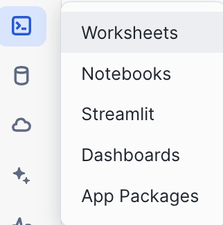

# <h1black>Create a </h1black><h1blue>Search Service</h1blue>

We now have quite a bit of unstructured data from the analyst reports, and the earnings calls and the infographics  - now how do we find it all? 

This is where you will build a search service.

You have experienced the key principle of RAG based searching while you were searching for relevant pieces of information in the **earnings call transcripts** section.

A search service uses this principle but simplifies th setup.

Cortex Search gets you up and running with a hybrid (vector and keyword) search engine on your text data in minutes, without having to worry about embedding, infrastructure maintenance, search quality parameter tuning, or ongoing index refreshes. This means you can spend less time on infrastructure and search quality tuning, and more time developing high-quality chat and search experiences using your data. 

- Go back to the home page and click on **Projects > Notebooks**

- Open the **CREATE_SEARCH_SERVICE** notebook

So we used Cortex Search to find things out about anything unstructured.  However, there will also be many datasets which we might want to include in our analysis which are infact Structured.  Some structured tables we have already processed using Document AI, but there will be other structured datasets. 

- Proceed to **Structured Data Processing** where we will start with transforming a stock prices and trading dataset from the **market place**.

    Click [Here](analyst.md) to continue

